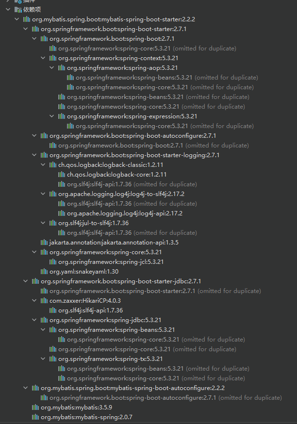
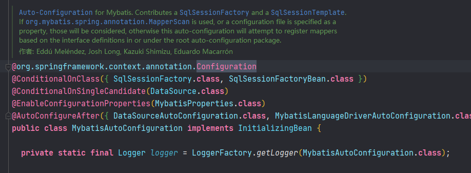
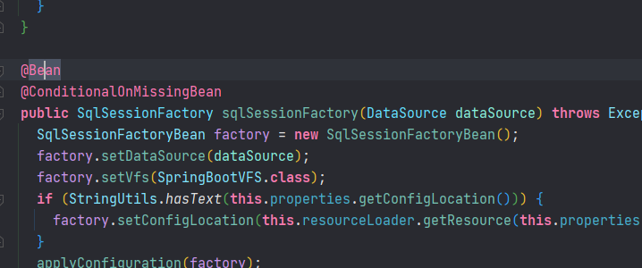
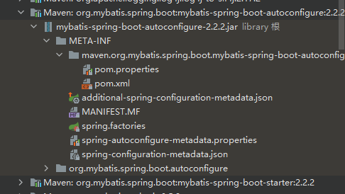
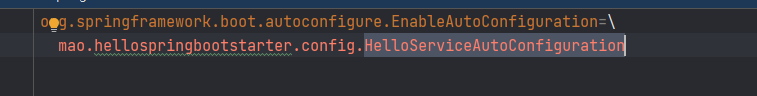
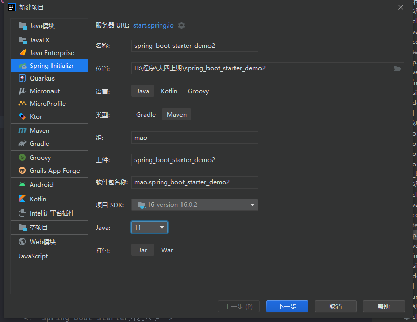
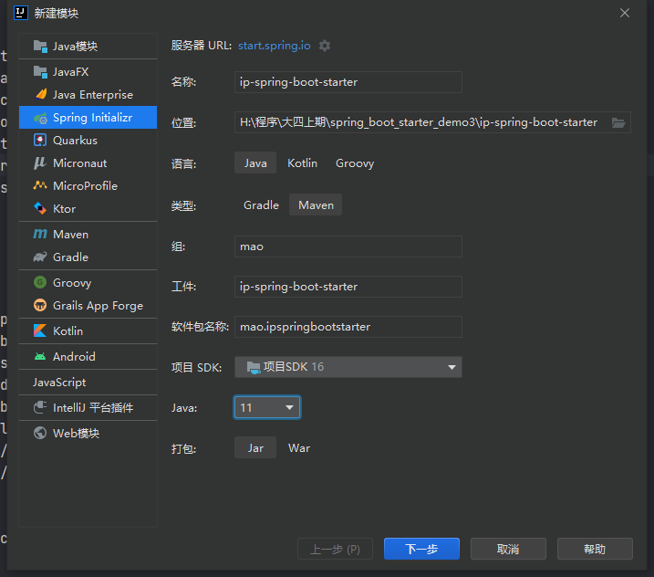
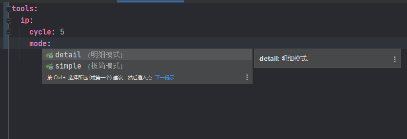

[TOC]

---


# Spring Boot starter

Spring Boot大大简化了项目初始搭建以及开发过程，而这些都是通过Spring Boot提供的starter来完成的


## starter介绍

spring boot 在配置上相比spring要简单许多, 其核心在于spring-boot-starter, 在使用spring boot来搭建一个项目时, 只需要引入官方提供的starter, 就可以直接使用, 免去了各种配置。starter简单来讲就是引入了一些相关依赖和一些初始化的配置。

Spring官方提供了很多starter，第三方也可以定义starter。为了加以区分，starter从名称上进行了如下规范：


* Spring官方提供的starter名称为：spring-boot-starter-xxx，例如Spring官方提供的spring-boot-starter-web
* 第三方提供的starter名称为：xxx-spring-boot-starter，例如由mybatis提供的mybatis-spring-boot-starter


## starter原理

Spring Boot之所以能够帮我们简化项目的搭建和开发过程，主要是基于它提供的起步依赖和自动配置。


### 起步依赖

起步依赖，其实就是将具备某种功能的坐标打包到一起，可以简化依赖导入的过程。例如，我们导入spring-boot-starter-web这个starter，则和web开发相关的jar包都一起导入到项目中了


```xml
<?xml version="1.0" encoding="UTF-8"?>
<project xsi:schemaLocation="http://maven.apache.org/POM/4.0.0 http://maven.apache.org/xsd/maven-4.0.0.xsd" xmlns="http://maven.apache.org/POM/4.0.0"
    xmlns:xsi="http://www.w3.org/2001/XMLSchema-instance">
  <!-- This module was also published with a richer model, Gradle metadata,  -->
  <!-- which should be used instead. Do not delete the following line which  -->
  <!-- is to indicate to Gradle or any Gradle module metadata file consumer  -->
  <!-- that they should prefer consuming it instead. -->
  <!-- do_not_remove: published-with-gradle-metadata -->
  <modelVersion>4.0.0</modelVersion>
  <groupId>org.springframework.boot</groupId>
  <artifactId>spring-boot-starter-web</artifactId>
  <version>2.7.1</version>
  <name>spring-boot-starter-web</name>
  <description>Starter for building web, including RESTful, applications using Spring MVC. Uses Tomcat as the default embedded container</description>
  <url>https://spring.io/projects/spring-boot</url>
  <organization>
    <name>Pivotal Software, Inc.</name>
    <url>https://spring.io</url>
  </organization>
  <licenses>
    <license>
      <name>Apache License, Version 2.0</name>
      <url>https://www.apache.org/licenses/LICENSE-2.0</url>
    </license>
  </licenses>
  <developers>
    <developer>
      <name>Pivotal</name>
      <email>info@pivotal.io</email>
      <organization>Pivotal Software, Inc.</organization>
      <organizationUrl>https://www.spring.io</organizationUrl>
    </developer>
  </developers>
  <scm>
    <connection>scm:git:git://github.com/spring-projects/spring-boot.git</connection>
    <developerConnection>scm:git:ssh://git@github.com/spring-projects/spring-boot.git</developerConnection>
    <url>https://github.com/spring-projects/spring-boot</url>
  </scm>
  <issueManagement>
    <system>GitHub</system>
    <url>https://github.com/spring-projects/spring-boot/issues</url>
  </issueManagement>
  <dependencies>
    <dependency>
      <groupId>org.springframework.boot</groupId>
      <artifactId>spring-boot-starter</artifactId>
      <version>2.7.1</version>
      <scope>compile</scope>
    </dependency>
    <dependency>
      <groupId>org.springframework.boot</groupId>
      <artifactId>spring-boot-starter-json</artifactId>
      <version>2.7.1</version>
      <scope>compile</scope>
    </dependency>
    <dependency>
      <groupId>org.springframework.boot</groupId>
      <artifactId>spring-boot-starter-tomcat</artifactId>
      <version>2.7.1</version>
      <scope>compile</scope>
    </dependency>
    <dependency>
      <groupId>org.springframework</groupId>
      <artifactId>spring-web</artifactId>
      <version>5.3.21</version>
      <scope>compile</scope>
    </dependency>
    <dependency>
      <groupId>org.springframework</groupId>
      <artifactId>spring-webmvc</artifactId>
      <version>5.3.21</version>
      <scope>compile</scope>
    </dependency>
  </dependencies>
</project>
```


### 自动配置

自动配置，就是无须手动配置xml，自动配置并管理bean，可以简化开发过程。那么Spring Boot是如何完成自动配置的呢？

自动配置涉及到如下几个关键步骤：


* 基于Java代码的Bean配置
* 自动配置条件依赖
* Bean参数获取
* Bean的发现
* Bean的加载


#### 基于Java代码的Bean配置

当我们在项目中导入了mybatis-spring-boot-starter这个jar后，可以看到它包括了很多相关的jar包





其中在mybatis-spring-boot-autoconfigure这个jar包中有如下一个**MybatisAutoConfiguration**自动配置类：


打开这个类，截取的关键代码如下：







**@Configuration**和**@Bean**这两个注解一起使用就可以创建一个基于java代码的配置类，可以用来替代传统的xml配置文件。

**@Configuration** 注解的类可以看作是能生产让Spring IoC容器管理的Bean实例的工厂。

**@Bean** 注解的方法返回的对象可以被注册到spring容器中。


所以上面的**MybatisAutoConfiguration**这个类，自动帮我们生成了SqlSessionFactory和SqlSessionTemplate这些Mybatis的重要实例并交给spring容器管理，从而完成bean的自动注册。


#### 自动配置条件依赖

要完成自动配置是有依赖条件的。


|              注解               |                       功能说明                       |
| :-----------------------------: | :--------------------------------------------------: |
|       @ConditionalOnBean        |  仅在当前上下文中存在某个bean时，才会实例化这个Bean  |
|       @ConditionalOnClass       |      某个class位于类路径上，才会实例化这个Bean       |
|    @ConditionalOnExpression     |       当表达式为true的时候，才会实例化这个Bean       |
|    @ConditionalOnMissingBean    | 仅在当前上下文中不存在某个bean时，才会实例化这个Bean |
|   @ConditionalOnMissingClass    | 某个class在类路径上不存在的时候，才会实例化这个Bean  |
| @ConditionalOnNotWebApplication |           不是web应用时才会实例化这个Bean            |
|       @AutoConfigureAfter       |        在某个bean完成自动配置后实例化这个bean        |
|      @AutoConfigureBefore       |        在某个bean完成自动配置前实例化这个bean        |


#### Bean参数获取

要完成mybatis的自动配置，需要我们在配置文件中提供数据源相关的配置参数，例如数据库驱动、连接url、数据库用户名、密码等。那么spring boot是如何读取yml或者properites配置文件的的属性来创建数据源对象的？

在我们导入mybatis-spring-boot-starter这个jar包后会传递过来一个spring-boot-autoconfigure包，在这个包中有一个自动配置类**DataSourceAutoConfiguration**


我们可以看到这个类上加入了**EnableConfigurationProperties**这个注解，继续跟踪源码到**DataSourceProperties**这个类


可以看到这个类上加入了**ConfigurationProperties**注解，这个注解的作用就是把yml或者properties配置文件中的配置参数信息封装到**ConfigurationProperties**注解标注的bean(即**DataSourceProperties**)的相应属性上


@**EnableConfigurationProperties**注解的作用是使@**ConfigurationProperties**注解生效。


#### Bean的发现

spring boot默认扫描启动类所在的包下的主类与子类的所有组件，但并没有包括依赖包中的类，那么依赖包中的bean是如何被发现和加载的？

我们需要从Spring Boot项目的启动类开始跟踪，在启动类上我们一般会加入SpringBootApplication注解


**SpringBootConfiguration**：作用就相当于**Configuration**注解，被注解的类将成为一个bean配置类

**ComponentScan**：作用就是自动扫描并加载符合条件的组件，最终将这些bean加载到spring容器中

**EnableAutoConfiguration** ：这个注解很重要，借助@**Import**的支持，收集和注册依赖包中相关的bean定义


继续跟踪**EnableAutoConfiguration**注解源码：


@**EnableAutoConfiguration**注解引入了@**Import**这个注解。

**Import**：导入需要自动配置的组件


继续跟踪**AutoConfigurationImportSelector**类源码：


**AutoConfigurationImportSelector**类的getCandidateConfigurations方法中的调用了SpringFactoriesLoader类的loadFactoryNames方法


**SpringFactoriesLoader**的**loadFactoryNames**静态方法可以从所有的jar包中读取META-INF/spring.factories文件，而自动配置的类就在这个文件中进行配置：





spring.factories文件内容如下：


```
# Auto Configure
org.springframework.boot.autoconfigure.EnableAutoConfiguration=\
org.mybatis.spring.boot.autoconfigure.MybatisLanguageDriverAutoConfiguration,\
org.mybatis.spring.boot.autoconfigure.MybatisAutoConfiguration
```


这样Spring Boot就可以加载到**MybatisAutoConfiguration**这个配置类了


#### Bean的加载

在Spring Boot应用中要让一个普通类交给Spring容器管理，通常有以下方法：

* 使用 @Configuration与@Bean 注解

* 使用@Controller @Service @Repository @Component 注解标注该类并且启用@ComponentScan自动扫描

* 使用@Import 方法

其中Spring Boot实现自动配置使用的是@Import注解这种方式，AutoConfigurationImportSelector类的selectImports方法返回一组从META-INF/spring.factories文件中读取的bean的全类名，这样Spring Boot就可以加载到这些Bean并完成实例的创建工作。


## 自定义starter

### 案例一

#### 开发starter


##### **第一步：初始化项目**


创建一个名字为spring_boot_starter_demo的父工程


创建一个名字为hello-spring-boot-starter的子工程，此工程用于开发starter给使用者使用


创建一个名字为use-starter的子工程，此工程用于使用之前的的starter


目录结构如下


父工程的pom文件：

```xml
<?xml version="1.0" encoding="UTF-8"?>
<project xmlns="http://maven.apache.org/POM/4.0.0" xmlns:xsi="http://www.w3.org/2001/XMLSchema-instance"
         xsi:schemaLocation="http://maven.apache.org/POM/4.0.0 https://maven.apache.org/xsd/maven-4.0.0.xsd">
    <modelVersion>4.0.0</modelVersion>


    <parent>
        <groupId>org.springframework.boot</groupId>
        <artifactId>spring-boot-starter-parent</artifactId>
        <version>2.7.1</version>
        <relativePath/>
    </parent>


    <groupId>mao</groupId>
    <artifactId>spring_boot_starter_demo</artifactId>
    <version>0.0.1</version>
    <name>spring_boot_starter_demo</name>
    <description>spring_boot_starter_demo</description>
    <packaging>pom</packaging>


    <properties>
        <java.version>11</java.version>
    </properties>

    <modules>

        <module>hello-spring-boot-starter</module>
        <module>use-starter</module>

    </modules>

    <dependencies>


    </dependencies>

    <dependencyManagement>

        <dependencies>


        </dependencies>

    </dependencyManagement>

    <build>
        <plugins>
            <plugin>
                <groupId>org.springframework.boot</groupId>
                <artifactId>spring-boot-maven-plugin</artifactId>
            </plugin>
        </plugins>
    </build>

</project>
```


hello-spring-boot-starter的pom文件：

```xml
<?xml version="1.0" encoding="UTF-8"?>
<project xmlns="http://maven.apache.org/POM/4.0.0" xmlns:xsi="http://www.w3.org/2001/XMLSchema-instance"
         xsi:schemaLocation="http://maven.apache.org/POM/4.0.0 https://maven.apache.org/xsd/maven-4.0.0.xsd">
    <modelVersion>4.0.0</modelVersion>

    <parent>
        <artifactId>spring_boot_starter_demo</artifactId>
        <groupId>mao</groupId>
        <version>0.0.1</version>
    </parent>

    <artifactId>hello-spring-boot-starter</artifactId>
    <version>0.0.1</version>
    <name>hello-spring-boot-starter</name>
    <description>hello-spring-boot-starter</description>

    <properties>
        <java.version>11</java.version>
    </properties>

    <dependencies>

        <dependency>
            <groupId>org.springframework.boot</groupId>
            <artifactId>spring-boot-starter-web</artifactId>
        </dependency>

        <!--spring boot starter开发依赖-->

        <dependency>
            <groupId>org.springframework.boot</groupId>
            <artifactId>spring-boot-starter</artifactId>
        </dependency>

        <dependency>
            <groupId>org.springframework.boot</groupId>
            <artifactId>spring-boot-autoconfigure</artifactId>
        </dependency>

        <dependency>
            <groupId>org.springframework.boot</groupId>
            <artifactId>spring-boot-configuration-processor</artifactId>
        </dependency>

    </dependencies>

    <build>
        <plugins>
            <plugin>
                <groupId>org.springframework.boot</groupId>
                <artifactId>spring-boot-maven-plugin</artifactId>
                <configuration>
                    <skip>true</skip>
                </configuration>
            </plugin>
        </plugins>
    </build>

</project>

```


use-starter的pom文件：

```xml
<?xml version="1.0" encoding="UTF-8"?>
<project xmlns="http://maven.apache.org/POM/4.0.0" xmlns:xsi="http://www.w3.org/2001/XMLSchema-instance"
         xsi:schemaLocation="http://maven.apache.org/POM/4.0.0 https://maven.apache.org/xsd/maven-4.0.0.xsd">
    <modelVersion>4.0.0</modelVersion>
    <parent>

        <artifactId>spring_boot_starter_demo</artifactId>
        <groupId>mao</groupId>
        <version>0.0.1</version>

    </parent>

    <artifactId>use-starter</artifactId>
    <version>0.0.1-SNAPSHOT</version>
    <name>use-starter</name>
    <description>use-starter</description>

    <properties>
        <java.version>11</java.version>
    </properties>


    <dependencies>

        <dependency>
            <groupId>org.springframework.boot</groupId>
            <artifactId>spring-boot-starter-web</artifactId>
        </dependency>

        <dependency>
            <groupId>org.springframework.boot</groupId>
            <artifactId>spring-boot-starter-test</artifactId>
            <scope>test</scope>
        </dependency>

    </dependencies>

    <build>
        <plugins>
            <plugin>
                <groupId>org.springframework.boot</groupId>
                <artifactId>spring-boot-maven-plugin</artifactId>
            </plugin>
        </plugins>
    </build>

</project>
```


打包测试项目是否配置正确

```sh
[INFO] Scanning for projects...
[INFO] ------------------------------------------------------------------------
[INFO] Reactor Build Order:
[INFO] 
[INFO] spring_boot_starter_demo                                           [pom]
[INFO] hello-spring-boot-starter                                          [jar]
[INFO] use-starter                                                        [jar]
[INFO] 
[INFO] --------------------< mao:spring_boot_starter_demo >--------------------
[INFO] Building spring_boot_starter_demo 0.0.1                            [1/3]
[INFO] --------------------------------[ pom ]---------------------------------
[INFO] 
[INFO] --- spring-boot-maven-plugin:2.7.1:repackage (repackage) @ spring_boot_starter_demo ---
[INFO] 
[INFO] -------------------< mao:hello-spring-boot-starter >--------------------
[INFO] Building hello-spring-boot-starter 0.0.1                           [2/3]
[INFO] --------------------------------[ jar ]---------------------------------
[INFO] 
[INFO] --- maven-resources-plugin:3.2.0:resources (default-resources) @ hello-spring-boot-starter ---
[INFO] Using 'UTF-8' encoding to copy filtered resources.
[INFO] Using 'UTF-8' encoding to copy filtered properties files.
[INFO] Copying 0 resource
[INFO] Copying 1 resource
[INFO] 
[INFO] --- maven-compiler-plugin:3.10.1:compile (default-compile) @ hello-spring-boot-starter ---
[INFO] Nothing to compile - all classes are up to date
[INFO] 
[INFO] --- maven-resources-plugin:3.2.0:testResources (default-testResources) @ hello-spring-boot-starter ---
[INFO] Using 'UTF-8' encoding to copy filtered resources.
[INFO] Using 'UTF-8' encoding to copy filtered properties files.
[INFO] skip non existing resourceDirectory H:\程序\大四上期\spring_boot_starter_demo\hello-spring-boot-starter\src\test\resources
[INFO] 
[INFO] --- maven-compiler-plugin:3.10.1:testCompile (default-testCompile) @ hello-spring-boot-starter ---
[INFO] No sources to compile
[INFO] 
[INFO] --- maven-surefire-plugin:2.22.2:test (default-test) @ hello-spring-boot-starter ---
[INFO] Tests are skipped.
[INFO] 
[INFO] --- maven-jar-plugin:3.2.2:jar (default-jar) @ hello-spring-boot-starter ---
[INFO] 
[INFO] --- spring-boot-maven-plugin:2.7.1:repackage (repackage) @ hello-spring-boot-starter ---
[INFO] 
[INFO] --------------------------< mao:use-starter >---------------------------
[INFO] Building use-starter 0.0.1-SNAPSHOT                                [3/3]
[INFO] --------------------------------[ jar ]---------------------------------
[INFO] 
[INFO] --- maven-resources-plugin:3.2.0:resources (default-resources) @ use-starter ---
[INFO] Using 'UTF-8' encoding to copy filtered resources.
[INFO] Using 'UTF-8' encoding to copy filtered properties files.
[INFO] Copying 1 resource
[INFO] Copying 0 resource
[INFO] 
[INFO] --- maven-compiler-plugin:3.10.1:compile (default-compile) @ use-starter ---
[INFO] Changes detected - recompiling the module!
[INFO] Compiling 2 source files to H:\程序\大四上期\spring_boot_starter_demo\use-starter\target\classes
[INFO] 
[INFO] --- maven-resources-plugin:3.2.0:testResources (default-testResources) @ use-starter ---
[INFO] Using 'UTF-8' encoding to copy filtered resources.
[INFO] Using 'UTF-8' encoding to copy filtered properties files.
[INFO] skip non existing resourceDirectory H:\程序\大四上期\spring_boot_starter_demo\use-starter\src\test\resources
[INFO] 
[INFO] --- maven-compiler-plugin:3.10.1:testCompile (default-testCompile) @ use-starter ---
[INFO] Changes detected - recompiling the module!
[INFO] Compiling 1 source file to H:\程序\大四上期\spring_boot_starter_demo\use-starter\target\test-classes
[INFO] 
[INFO] --- maven-surefire-plugin:2.22.2:test (default-test) @ use-starter ---
[INFO] Tests are skipped.
[INFO] 
[INFO] --- maven-jar-plugin:3.2.2:jar (default-jar) @ use-starter ---
[INFO] Building jar: H:\程序\大四上期\spring_boot_starter_demo\use-starter\target\use-starter-0.0.1-SNAPSHOT.jar
[INFO] 
[INFO] --- spring-boot-maven-plugin:2.7.1:repackage (repackage) @ use-starter ---
[INFO] Replacing main artifact with repackaged archive
[INFO] ------------------------------------------------------------------------
[INFO] Reactor Summary:
[INFO] 
[INFO] spring_boot_starter_demo 0.0.1 ..................... SUCCESS [  0.833 s]
[INFO] hello-spring-boot-starter 0.0.1 .................... SUCCESS [  1.282 s]
[INFO] use-starter 0.0.1-SNAPSHOT ......................... SUCCESS [  1.738 s]
[INFO] ------------------------------------------------------------------------
[INFO] BUILD SUCCESS
[INFO] ------------------------------------------------------------------------
[INFO] Total time:  4.189 s
[INFO] Finished at: 2022-10-24T22:02:54+08:00
[INFO] ------------------------------------------------------------------------
```


没有报错


##### **第二步：创建配置属性类HelloConfigProperties**


```java
package mao.hellospringbootstarter.config;

import org.springframework.boot.context.properties.ConfigurationProperties;

/**
 * Project name(项目名称)：spring_boot_starter_demo
 * Package(包名): mao.hellospringbootstarter.config
 * Class(类名): HelloConfigProperties
 * Author(作者）: mao
 * Author QQ：1296193245
 * GitHub：https://github.com/maomao124/
 * Date(创建日期)： 2022/10/24
 * Time(创建时间)： 20:23
 * Version(版本): 1.0
 * Description(描述)： 无
 */


@ConfigurationProperties(prefix = "hello")
public class HelloConfigProperties
{
    /**
     * 名字
     */
    private String name;
    /**
     * 性
     */
    private String sex;
    /**
     * 年龄
     */
    private String age;
    /**
     * 地址
     */
    private String address;

    /**
     * Instantiates a new Hello config properties.
     */
    public HelloConfigProperties()
    {
    }

    /**
     * Instantiates a new Hello config properties.
     *
     * @param name    the name
     * @param sex     the sex
     * @param age     the age
     * @param address the address
     */
    public HelloConfigProperties(String name, String sex, String age, String address)
    {
        this.name = name;
        this.sex = sex;
        this.age = age;
        this.address = address;
    }

    /**
     * Gets name.
     *
     * @return the name
     */
    public String getName()
    {
        return name;
    }

    /**
     * Sets name.
     *
     * @param name the name
     */
    public void setName(String name)
    {
        this.name = name;
    }

    /**
     * Gets sex.
     *
     * @return the sex
     */
    public String getSex()
    {
        return sex;
    }

    /**
     * Sets sex.
     *
     * @param sex the sex
     */
    public void setSex(String sex)
    {
        this.sex = sex;
    }

    /**
     * Gets age.
     *
     * @return the age
     */
    public String getAge()
    {
        return age;
    }

    /**
     * Sets age.
     *
     * @param age the age
     */
    public void setAge(String age)
    {
        this.age = age;
    }

    /**
     * Gets address.
     *
     * @return the address
     */
    public String getAddress()
    {
        return address;
    }

    /**
     * Sets address.
     *
     * @param address the address
     */
    public void setAddress(String address)
    {
        this.address = address;
    }

    @Override
    @SuppressWarnings("all")
    public String toString()
    {
        final StringBuilder stringbuilder = new StringBuilder();
        stringbuilder.append("name：").append(name).append('\n');
        stringbuilder.append("sex：").append(sex).append('\n');
        stringbuilder.append("age：").append(age).append('\n');
        stringbuilder.append("address：").append(address).append('\n');
        return stringbuilder.toString();
    }
}
```


##### **第三步：创建HelloService**


```java
package mao.hellospringbootstarter.service;

import mao.hellospringbootstarter.config.HelloConfigProperties;
import org.springframework.beans.factory.annotation.Autowired;
import org.springframework.stereotype.Service;

/**
 * Project name(项目名称)：spring_boot_starter_demo
 * Package(包名): mao.hellospringbootstarter.service
 * Class(类名): HelloService
 * Author(作者）: mao
 * Author QQ：1296193245
 * GitHub：https://github.com/maomao124/
 * Date(创建日期)： 2022/10/24
 * Time(创建时间)： 20:33
 * Version(版本): 1.0
 * Description(描述)： 无
 */

//@Service
public class HelloService
{
    /**
     * 配置属性类
     */
    private final HelloConfigProperties helloConfigProperties;

    @Autowired
    public HelloService(HelloConfigProperties helloConfigProperties)
    {
        this.helloConfigProperties = helloConfigProperties;
    }

    /**
     * hello
     *
     * @return {@link String}
     */
    public String hello()
    {
        return "你好！我的名字是" + helloConfigProperties.getName() +
                ",年龄是：" + helloConfigProperties.getAge() +
                ",地址是：" + helloConfigProperties.getAddress() +
                ",性别是：" + helloConfigProperties.getSex();
    }
}

```


##### **第四步：创建自动配置类HelloServiceAutoConfiguration**


```java
package mao.hellospringbootstarter.config;

import mao.hellospringbootstarter.service.HelloService;
import org.slf4j.Logger;
import org.slf4j.LoggerFactory;
import org.springframework.beans.factory.annotation.Autowired;
import org.springframework.boot.autoconfigure.condition.ConditionalOnMissingBean;
import org.springframework.boot.context.properties.EnableConfigurationProperties;
import org.springframework.context.annotation.Bean;
import org.springframework.context.annotation.ComponentScan;
import org.springframework.context.annotation.Configuration;

import javax.annotation.PostConstruct;

/**
 * Project name(项目名称)：spring_boot_starter_demo
 * Package(包名): mao.hellospringbootstarter.config
 * Class(类名): HelloServiceAutoConfiguration
 * Author(作者）: mao
 * Author QQ：1296193245
 * GitHub：https://github.com/maomao124/
 * Date(创建日期)： 2022/10/24
 * Time(创建时间)： 20:38
 * Version(版本): 1.0
 * Description(描述)： 无
 */

@Configuration
@EnableConfigurationProperties(HelloConfigProperties.class)
//@ComponentScan(basePackageClasses = {HelloService.class})
public class HelloServiceAutoConfiguration
{

    /**
     * 日志
     */
    private static final Logger log = LoggerFactory.getLogger(HelloServiceAutoConfiguration.class);

    @Bean
    @ConditionalOnMissingBean
    public HelloService helloService(@Autowired HelloConfigProperties helloConfigProperties)
    {
        log.info("初始化bean:HelloService");
        return new HelloService(helloConfigProperties);
    }

    @PostConstruct
    public void init()
    {
        log.info("初始化bean");
    }

}

```


##### **第五步：在resources目录下创建META-INF/spring.factories**


```
org.springframework.boot.autoconfigure.EnableAutoConfiguration=\
  mao.hellospringbootstarter.config.HelloServiceAutoConfiguration
```





至此starter已经开发完成了，可以将当前starter安装到本地maven仓库供其他应用来使用


结构：


#### 使用starter


##### **第一步：在use-starter子工程中修改pom文件**


导入hello-spring-boot-starter


```xml
<?xml version="1.0" encoding="UTF-8"?>
<project xmlns="http://maven.apache.org/POM/4.0.0" xmlns:xsi="http://www.w3.org/2001/XMLSchema-instance"
         xsi:schemaLocation="http://maven.apache.org/POM/4.0.0 https://maven.apache.org/xsd/maven-4.0.0.xsd">
    <modelVersion>4.0.0</modelVersion>
    <parent>

        <artifactId>spring_boot_starter_demo</artifactId>
        <groupId>mao</groupId>
        <version>0.0.1</version>

    </parent>

    <artifactId>use-starter</artifactId>
    <version>0.0.1-SNAPSHOT</version>
    <name>use-starter</name>
    <description>use-starter</description>

    <properties>
        <java.version>11</java.version>
    </properties>


    <dependencies>

        <dependency>
            <groupId>org.springframework.boot</groupId>
            <artifactId>spring-boot-starter-web</artifactId>
        </dependency>

        <dependency>
            <groupId>org.springframework.boot</groupId>
            <artifactId>spring-boot-starter-test</artifactId>
            <scope>test</scope>
        </dependency>

        <dependency>
            <groupId>mao</groupId>
            <artifactId>hello-spring-boot-starter</artifactId>
            <version>0.0.1</version>
        </dependency>

    </dependencies>

    <build>
        <plugins>
            <plugin>
                <groupId>org.springframework.boot</groupId>
                <artifactId>spring-boot-maven-plugin</artifactId>
            </plugin>
        </plugins>
    </build>

</project>
```


##### **第二步：创建application.yml文件添加配置**


```yaml
server:
  port: 9090

hello:
  name: 张三
  sex: 男
  age: 18
  address: 中国
```


##### **第三步：创建HelloController**


```java
package mao.usestarter.controller;

import mao.hellospringbootstarter.service.HelloService;
import org.springframework.beans.factory.annotation.Autowired;
import org.springframework.web.bind.annotation.GetMapping;
import org.springframework.web.bind.annotation.RestController;

/**
 * Project name(项目名称)：spring_boot_starter_demo
 * Package(包名): mao.usestarter.controller
 * Class(类名): HelloController
 * Author(作者）: mao
 * Author QQ：1296193245
 * GitHub：https://github.com/maomao124/
 * Date(创建日期)： 2022/10/24
 * Time(创建时间)： 20:55
 * Version(版本): 1.0
 * Description(描述)： 无
 */

@RestController
public class HelloController
{
    @Autowired
    private HelloService helloService;


    @GetMapping("/test")
    public String test()
    {
        return helloService.hello();
    }
}
```


##### **第四步：启动项目**


```sh
 .   ____          _            __ _ _
 /\\ / ___'_ __ _ _(_)_ __  __ _ \ \ \ \
( ( )\___ | '_ | '_| | '_ \/ _` | \ \ \ \
 \\/  ___)| |_)| | | | | || (_| |  ) ) ) )
  '  |____| .__|_| |_|_| |_\__, | / / / /
 =========|_|==============|___/=/_/_/_/
 :: Spring Boot ::                (v2.7.1)

2022-10-24 22:09:13.951  INFO 12768 --- [           main] mao.usestarter.UseStarterApplication     : Starting UseStarterApplication using Java 16.0.2 on mao with PID 12768 (H:\程序\大四上期\spring_boot_starter_demo\use-starter\target\classes started by mao in H:\程序\大四上期\spring_boot_starter_demo)
2022-10-24 22:09:13.953  INFO 12768 --- [           main] mao.usestarter.UseStarterApplication     : No active profile set, falling back to 1 default profile: "default"
2022-10-24 22:09:14.641  INFO 12768 --- [           main] o.s.b.w.embedded.tomcat.TomcatWebServer  : Tomcat initialized with port(s): 8086 (http)
2022-10-24 22:09:14.649  INFO 12768 --- [           main] o.apache.catalina.core.StandardService   : Starting service [Tomcat]
2022-10-24 22:09:14.649  INFO 12768 --- [           main] org.apache.catalina.core.StandardEngine  : Starting Servlet engine: [Apache Tomcat/9.0.64]
2022-10-24 22:09:14.723  INFO 12768 --- [           main] o.a.c.c.C.[Tomcat].[localhost].[/]       : Initializing Spring embedded WebApplicationContext
2022-10-24 22:09:14.723  INFO 12768 --- [           main] w.s.c.ServletWebServerApplicationContext : Root WebApplicationContext: initialization completed in 722 ms
2022-10-24 22:09:14.759  INFO 12768 --- [           main] m.h.c.HelloServiceAutoConfiguration      : 初始化bean
2022-10-24 22:09:14.768  INFO 12768 --- [           main] m.h.c.HelloServiceAutoConfiguration      : 初始化bean:HelloService
2022-10-24 22:09:14.982  INFO 12768 --- [           main] o.s.b.w.embedded.tomcat.TomcatWebServer  : Tomcat started on port(s): 8086 (http) with context path ''
2022-10-24 22:09:14.991  INFO 12768 --- [           main] mao.usestarter.UseStarterApplication     : Started UseStarterApplication in 1.347 seconds (JVM running for 1.808)
```


##### **第五步：访问**

http://localhost:8086/test


##### **第六步：更改配置**


```yaml
server:
  port: 8086

hello:
  name: 张三
  sex: 男
  age: 21
  address: 中国
```


##### **第七步：重启服务器，再次访问**


### 案例二

说明：通过自动配置来创建一个拦截器对象，通过此拦截器对象来实现记录日志功能


#### 开发starter


##### **第一步：初始化项目**


创建父工程spring_boot_starter_demo2





创建子工程log-spring-boot-starter


创建子工程use-starter


结构：


父工程spring_boot_starter_demo2的pom文件：

```xml
<?xml version="1.0" encoding="UTF-8"?>
<project xmlns="http://maven.apache.org/POM/4.0.0" xmlns:xsi="http://www.w3.org/2001/XMLSchema-instance"
         xsi:schemaLocation="http://maven.apache.org/POM/4.0.0 https://maven.apache.org/xsd/maven-4.0.0.xsd">
    <modelVersion>4.0.0</modelVersion>

    <parent>
        <groupId>org.springframework.boot</groupId>
        <artifactId>spring-boot-starter-parent</artifactId>
        <version>2.7.1</version>
        <relativePath/>
    </parent>

    <groupId>mao</groupId>
    <artifactId>spring_boot_starter_demo2</artifactId>
    <version>0.0.1</version>
    <name>spring_boot_starter_demo2</name>
    <description>spring_boot_starter_demo2</description>
    <packaging>pom</packaging>

    <properties>
        <java.version>11</java.version>
    </properties>

    <modules>

        <module>log-spring-boot-starter</module>
        <module>use-starter</module>

    </modules>

    <dependencies>


    </dependencies>

    <dependencyManagement>

        <dependencies>


        </dependencies>

    </dependencyManagement>


    <build>
        <plugins>
            <plugin>
                <groupId>org.springframework.boot</groupId>
                <artifactId>spring-boot-maven-plugin</artifactId>
            </plugin>
        </plugins>
    </build>

</project>
```


子工程log-spring-boot-starter的pom文件：

```xml
<?xml version="1.0" encoding="UTF-8"?>
<project xmlns="http://maven.apache.org/POM/4.0.0" xmlns:xsi="http://www.w3.org/2001/XMLSchema-instance"
         xsi:schemaLocation="http://maven.apache.org/POM/4.0.0 https://maven.apache.org/xsd/maven-4.0.0.xsd">
    <modelVersion>4.0.0</modelVersion>

    <parent>

        <artifactId>spring_boot_starter_demo2</artifactId>
        <groupId>mao</groupId>
        <version>0.0.1</version>

    </parent>


    <artifactId>log-spring-boot-starter</artifactId>
    <version>0.0.1-SNAPSHOT</version>
    <name>log-spring-boot-starter</name>
    <description>log-spring-boot-starter</description>

    <properties>
        <java.version>11</java.version>
    </properties>

    <dependencies>

        <dependency>
            <groupId>org.springframework.boot</groupId>
            <artifactId>spring-boot-starter-web</artifactId>
        </dependency>


        <!--spring boot starter开发依赖-->
        <dependency>
            <groupId>org.springframework.boot</groupId>
            <artifactId>spring-boot-starter</artifactId>
        </dependency>

        <dependency>
            <groupId>org.springframework.boot</groupId>
            <artifactId>spring-boot-autoconfigure</artifactId>
        </dependency>

        <dependency>
            <groupId>org.springframework.boot</groupId>
            <artifactId>spring-boot-configuration-processor</artifactId>
        </dependency>

    </dependencies>

    <build>
        <plugins>
            <plugin>
                <groupId>org.springframework.boot</groupId>
                <artifactId>spring-boot-maven-plugin</artifactId>
                <configuration>
                    <skip>
                        true
                    </skip>
                </configuration>
            </plugin>
        </plugins>
    </build>

</project>
```


子工程use-starter的pom文件：

```xml
<?xml version="1.0" encoding="UTF-8"?>
<project xmlns="http://maven.apache.org/POM/4.0.0" xmlns:xsi="http://www.w3.org/2001/XMLSchema-instance"
         xsi:schemaLocation="http://maven.apache.org/POM/4.0.0 https://maven.apache.org/xsd/maven-4.0.0.xsd">
    <modelVersion>4.0.0</modelVersion>

    <parent>

        <artifactId>spring_boot_starter_demo2</artifactId>
        <groupId>mao</groupId>
        <version>0.0.1</version>

    </parent>


    <artifactId>use-starter</artifactId>
    <version>0.0.1-SNAPSHOT</version>
    <name>use-starter</name>
    <description>use-starter</description>

    <properties>
        <java.version>11</java.version>
    </properties>

    <dependencies>

        <dependency>
            <groupId>org.springframework.boot</groupId>
            <artifactId>spring-boot-starter-web</artifactId>
        </dependency>

        <dependency>
            <groupId>org.springframework.boot</groupId>
            <artifactId>spring-boot-starter-test</artifactId>
            <scope>test</scope>
        </dependency>

    </dependencies>

    <build>
        <plugins>
            <plugin>
                <groupId>org.springframework.boot</groupId>
                <artifactId>spring-boot-maven-plugin</artifactId>
            </plugin>
        </plugins>
    </build>

</project>
```


##### **第二步：自定义Log注解**


```java
package mao.logspringbootstarter.log;


import java.lang.annotation.ElementType;
import java.lang.annotation.Retention;
import java.lang.annotation.RetentionPolicy;
import java.lang.annotation.Target;

@Target(ElementType.METHOD) //ElementType.METHOD：只用在方法上
@Retention(RetentionPolicy.RUNTIME)
public @interface Log
{
    /**
     * 方法的描述信息
     *
     * @return {@link String}
     */
    String desc() default "";
}
```


##### **第三步：自定义日志拦截器LogInterceptor**


```java
package mao.logspringbootstarter.interceptor;

import mao.logspringbootstarter.log.Log;
import org.slf4j.Logger;
import org.slf4j.LoggerFactory;
import org.springframework.web.method.HandlerMethod;
import org.springframework.web.servlet.HandlerInterceptor;
import org.springframework.web.servlet.ModelAndView;
import org.springframework.web.servlet.handler.HandlerInterceptorAdapter;

import javax.servlet.http.HttpServletRequest;
import javax.servlet.http.HttpServletResponse;
import java.lang.reflect.Method;

/**
 * Project name(项目名称)：spring_boot_starter_demo2
 * Package(包名): mao.logspringbootstarter.interceptor
 * Class(类名): LogInterceptor
 * Author(作者）: mao
 * Author QQ：1296193245
 * GitHub：https://github.com/maomao124/
 * Date(创建日期)： 2022/10/24
 * Time(创建时间)： 22:39
 * Version(版本): 1.0
 * Description(描述)： 无
 */

public class LogInterceptor implements HandlerInterceptor
{

    private static final ThreadLocal<Long> THREAD_LOCAL = new ThreadLocal<>();

    private static final Logger logger = LoggerFactory.getLogger(LogInterceptor.class);

    @Override
    public boolean preHandle(HttpServletRequest request, HttpServletResponse response, Object handler) throws Exception
    {
        if (handler instanceof HandlerMethod)
        {
            HandlerMethod handlerMethod = (HandlerMethod) handler;
            Method method = handlerMethod.getMethod();
            Log log = method.getAnnotation(Log.class);
            if (log != null)
            {
                long startTime = System.currentTimeMillis();
                THREAD_LOCAL.set(startTime);
            }
        }
        return true;
    }

    @Override
    public void postHandle(HttpServletRequest request, HttpServletResponse response, Object handler, ModelAndView modelAndView)
            throws Exception
    {
        if (handler instanceof HandlerMethod)
        {
            long endTime = System.currentTimeMillis();
            HandlerMethod handlerMethod = (HandlerMethod) handler;
            Method method = handlerMethod.getMethod();
            Log log = method.getAnnotation(Log.class);
            if (log != null)
            {
                Long startTime = THREAD_LOCAL.get();
                long runTime = endTime - startTime;
                String uri = request.getRequestURI();
                String methodName = method.getDeclaringClass().getName() + "." + method.getName();
                String desc = log.desc();
                logger.info("请求的url：" + uri + "，方法名：" + methodName + "，描述：" + desc + "，运行时间：" + runTime + "ms");
                THREAD_LOCAL.remove();
            }
        }
    }
}

```


##### **第四步：创建自动配置类LogAutoConfiguration，用于自动配置拦截器、参数解析器等web组件**


```java
package mao.logspringbootstarter.config;

import mao.logspringbootstarter.interceptor.LogInterceptor;
import org.springframework.context.annotation.Configuration;
import org.springframework.web.servlet.config.annotation.InterceptorRegistry;
import org.springframework.web.servlet.config.annotation.WebMvcConfigurer;

/**
 * Project name(项目名称)：spring_boot_starter_demo2
 * Package(包名): mao.logspringbootstarter.config
 * Class(类名): LogAutoConfiguration
 * Author(作者）: mao
 * Author QQ：1296193245
 * GitHub：https://github.com/maomao124/
 * Date(创建日期)： 2022/10/24
 * Time(创建时间)： 22:51
 * Version(版本): 1.0
 * Description(描述)： 无
 */


@Configuration
public class LogAutoConfiguration implements WebMvcConfigurer
{
    @Override
    public void addInterceptors(InterceptorRegistry registry)
    {
        registry.addInterceptor(new LogInterceptor());
    }
}
```


##### **第五步：在spring.factories中追加LogAutoConfiguration配置**


```
org.springframework.boot.autoconfigure.EnableAutoConfiguration=\
  mao.logspringbootstarter.config.LogAutoConfiguration
```


##### **第六步：安装到本地库**


```sh
[INFO] Scanning for projects...
[INFO] 
[INFO] --------------------< mao:log-spring-boot-starter >---------------------
[INFO] Building log-spring-boot-starter 0.0.1-SNAPSHOT
[INFO] --------------------------------[ jar ]---------------------------------
[INFO] 
[INFO] --- maven-resources-plugin:3.2.0:resources (default-resources) @ log-spring-boot-starter ---
[INFO] Using 'UTF-8' encoding to copy filtered resources.
[INFO] Using 'UTF-8' encoding to copy filtered properties files.
[INFO] Copying 0 resource
[INFO] Copying 1 resource
[INFO] 
[INFO] --- maven-compiler-plugin:3.10.1:compile (default-compile) @ log-spring-boot-starter ---
[INFO] Changes detected - recompiling the module!
[INFO] Compiling 4 source files to H:\程序\大四上期\spring_boot_starter_demo2\log-spring-boot-starter\target\classes
[INFO] 
[INFO] --- maven-resources-plugin:3.2.0:testResources (default-testResources) @ log-spring-boot-starter ---
[INFO] Using 'UTF-8' encoding to copy filtered resources.
[INFO] Using 'UTF-8' encoding to copy filtered properties files.
[INFO] skip non existing resourceDirectory H:\程序\大四上期\spring_boot_starter_demo2\log-spring-boot-starter\src\test\resources
[INFO] 
[INFO] --- maven-compiler-plugin:3.10.1:testCompile (default-testCompile) @ log-spring-boot-starter ---
[INFO] No sources to compile
[INFO] 
[INFO] --- maven-surefire-plugin:2.22.2:test (default-test) @ log-spring-boot-starter ---
[INFO] Tests are skipped.
[INFO] 
[INFO] --- maven-jar-plugin:3.2.2:jar (default-jar) @ log-spring-boot-starter ---
[INFO] Building jar: H:\程序\大四上期\spring_boot_starter_demo2\log-spring-boot-starter\target\log-spring-boot-starter-0.0.1-SNAPSHOT.jar
[INFO] 
[INFO] --- spring-boot-maven-plugin:2.7.1:repackage (repackage) @ log-spring-boot-starter ---
[INFO] 
[INFO] --- maven-install-plugin:2.5.2:install (default-install) @ log-spring-boot-starter ---
[INFO] Installing H:\程序\大四上期\spring_boot_starter_demo2\log-spring-boot-starter\target\log-spring-boot-starter-0.0.1-SNAPSHOT.jar to C:\Users\mao\.m2\repository\mao\log-spring-boot-starter\0.0.1-SNAPSHOT\log-spring-boot-starter-0.0.1-SNAPSHOT.jar
[INFO] Installing H:\程序\大四上期\spring_boot_starter_demo2\log-spring-boot-starter\pom.xml to C:\Users\mao\.m2\repository\mao\log-spring-boot-starter\0.0.1-SNAPSHOT\log-spring-boot-starter-0.0.1-SNAPSHOT.pom
[INFO] ------------------------------------------------------------------------
[INFO] BUILD SUCCESS
[INFO] ------------------------------------------------------------------------
[INFO] Total time:  3.665 s
[INFO] Finished at: 2022-10-24T22:56:59+08:00
[INFO] ------------------------------------------------------------------------
```


#### 使用starter


##### **第一步：添加依赖**


```xml
<?xml version="1.0" encoding="UTF-8"?>
<project xmlns="http://maven.apache.org/POM/4.0.0" xmlns:xsi="http://www.w3.org/2001/XMLSchema-instance"
         xsi:schemaLocation="http://maven.apache.org/POM/4.0.0 https://maven.apache.org/xsd/maven-4.0.0.xsd">
    <modelVersion>4.0.0</modelVersion>

    <parent>

        <artifactId>spring_boot_starter_demo2</artifactId>
        <groupId>mao</groupId>
        <version>0.0.1</version>

    </parent>


    <artifactId>use-starter</artifactId>
    <version>0.0.1-SNAPSHOT</version>
    <name>use-starter</name>
    <description>use-starter</description>

    <properties>
        <java.version>11</java.version>
    </properties>

    <dependencies>

        <dependency>
            <groupId>org.springframework.boot</groupId>
            <artifactId>spring-boot-starter-web</artifactId>
        </dependency>

        <dependency>
            <groupId>org.springframework.boot</groupId>
            <artifactId>spring-boot-starter-test</artifactId>
            <scope>test</scope>
        </dependency>

        <dependency>
            <groupId>mao</groupId>
            <artifactId>log-spring-boot-starter</artifactId>
            <version>0.0.1-SNAPSHOT</version>
        </dependency>

    </dependencies>

    <build>
        <plugins>
            <plugin>
                <groupId>org.springframework.boot</groupId>
                <artifactId>spring-boot-maven-plugin</artifactId>
            </plugin>
        </plugins>
    </build>

</project>
```


##### **第二步：编写controller类**


```java
package mao.usestarter.controller;

import mao.logspringbootstarter.log.Log;
import org.springframework.web.bind.annotation.GetMapping;
import org.springframework.web.bind.annotation.RestController;

/**
 * Project name(项目名称)：spring_boot_starter_demo2
 * Package(包名): mao.usestarter.controller
 * Class(类名): TestController
 * Author(作者）: mao
 * Author QQ：1296193245
 * GitHub：https://github.com/maomao124/
 * Date(创建日期)： 2022/10/24
 * Time(创建时间)： 23:01
 * Version(版本): 1.0
 * Description(描述)： 无
 */

@RestController
public class TestController
{
    /**
     * test1
     *
     * @return {@link String}
     */
    @GetMapping("/test1")
    @Log
    public String test1()
    {
        return "1 success";
    }

    /**
     * test2
     *
     * @return {@link String}
     */
    @GetMapping("/test2")
    @Log
    public String test2()
    {
        try
        {
            Thread.sleep(200);
        }
        catch (InterruptedException e)
        {
            e.printStackTrace();
        }
        return "2 success";
    }

    /**
     * test3
     *
     * @return {@link String}
     */
    @GetMapping("/test3")
    @Log
    public String test3()
    {
        try
        {
            Thread.sleep(500);
        }
        catch (InterruptedException e)
        {
            e.printStackTrace();
        }
        return "3 success";
    }

    /**
     * test4
     *
     * @return {@link String}
     */
    @GetMapping("/test4")
    @Log
    public String test4()
    {
        try
        {
            Thread.sleep(1000);
        }
        catch (InterruptedException e)
        {
            e.printStackTrace();
        }
        return "4 success";
    }

    /**
     * test5
     *
     * @return {@link String}
     */
    @GetMapping("/test5")
    @Log(desc = "这是test5方法的描述信息")
    public String test5()
    {
        return "5 success";
    }

    /**
     * test6
     *
     * @return {@link String}
     */
    @GetMapping("/test6")
    public String test6()
    {
        return "6 success";
    }
}

```


##### **第三步：启动程序**


```sh

  .   ____          _            __ _ _
 /\\ / ___'_ __ _ _(_)_ __  __ _ \ \ \ \
( ( )\___ | '_ | '_| | '_ \/ _` | \ \ \ \
 \\/  ___)| |_)| | | | | || (_| |  ) ) ) )
  '  |____| .__|_| |_|_| |_\__, | / / / /
 =========|_|==============|___/=/_/_/_/
 :: Spring Boot ::                (v2.7.1)

2022-10-24 23:23:08.546  INFO 2356 --- [           main] mao.usestarter.UseStarterApplication     : Starting UseStarterApplication using Java 16.0.2 on mao with PID 2356 (H:\程序\大四上期\spring_boot_starter_demo2\use-starter\target\classes started by mao in H:\程序\大四上期\spring_boot_starter_demo2)
2022-10-24 23:23:08.548  INFO 2356 --- [           main] mao.usestarter.UseStarterApplication     : No active profile set, falling back to 1 default profile: "default"
2022-10-24 23:23:09.216  INFO 2356 --- [           main] o.s.b.w.embedded.tomcat.TomcatWebServer  : Tomcat initialized with port(s): 8080 (http)
2022-10-24 23:23:09.223  INFO 2356 --- [           main] o.apache.catalina.core.StandardService   : Starting service [Tomcat]
2022-10-24 23:23:09.223  INFO 2356 --- [           main] org.apache.catalina.core.StandardEngine  : Starting Servlet engine: [Apache Tomcat/9.0.64]
2022-10-24 23:23:09.303  INFO 2356 --- [           main] o.a.c.c.C.[Tomcat].[localhost].[/]       : Initializing Spring embedded WebApplicationContext
2022-10-24 23:23:09.304  INFO 2356 --- [           main] w.s.c.ServletWebServerApplicationContext : Root WebApplicationContext: initialization completed in 721 ms
2022-10-24 23:23:09.547  INFO 2356 --- [           main] o.s.b.w.embedded.tomcat.TomcatWebServer  : Tomcat started on port(s): 8080 (http) with context path ''
2022-10-24 23:23:09.556  INFO 2356 --- [           main] mao.usestarter.UseStarterApplication     : Started UseStarterApplication in 1.267 seconds (JVM running for 1.74)
```


##### **第四步：访问服务**

http://localhost:8080/test1


从test1到test6，每个资源请求3遍：

```sh
2022-10-24 23:26:03.034  INFO 8120 --- [nio-8080-exec-6] m.l.interceptor.LogInterceptor           : 请求的url：/test1，方法名：mao.usestarter.controller.TestController.test1，描述：，运行时间：1ms
2022-10-24 23:26:04.392  INFO 8120 --- [nio-8080-exec-7] m.l.interceptor.LogInterceptor           : 请求的url：/test1，方法名：mao.usestarter.controller.TestController.test1，描述：，运行时间：1ms
2022-10-24 23:26:05.006  INFO 8120 --- [nio-8080-exec-8] m.l.interceptor.LogInterceptor           : 请求的url：/test1，方法名：mao.usestarter.controller.TestController.test1，描述：，运行时间：1ms
2022-10-24 23:26:07.567  INFO 8120 --- [nio-8080-exec-9] m.l.interceptor.LogInterceptor           : 请求的url：/test2，方法名：mao.usestarter.controller.TestController.test2，描述：，运行时间：215ms
2022-10-24 23:26:08.724  INFO 8120 --- [io-8080-exec-10] m.l.interceptor.LogInterceptor           : 请求的url：/test2，方法名：mao.usestarter.controller.TestController.test2，描述：，运行时间：212ms
2022-10-24 23:26:09.500  INFO 8120 --- [nio-8080-exec-1] m.l.interceptor.LogInterceptor           : 请求的url：/test2，方法名：mao.usestarter.controller.TestController.test2，描述：，运行时间：211ms
2022-10-24 23:26:12.514  INFO 8120 --- [nio-8080-exec-3] m.l.interceptor.LogInterceptor           : 请求的url：/test3，方法名：mao.usestarter.controller.TestController.test3，描述：，运行时间：510ms
2022-10-24 23:26:13.597  INFO 8120 --- [nio-8080-exec-2] m.l.interceptor.LogInterceptor           : 请求的url：/test3，方法名：mao.usestarter.controller.TestController.test3，描述：，运行时间：503ms
2022-10-24 23:26:14.892  INFO 8120 --- [nio-8080-exec-4] m.l.interceptor.LogInterceptor           : 请求的url：/test3，方法名：mao.usestarter.controller.TestController.test3，描述：，运行时间：514ms
2022-10-24 23:26:17.936  INFO 8120 --- [nio-8080-exec-5] m.l.interceptor.LogInterceptor           : 请求的url：/test4，方法名：mao.usestarter.controller.TestController.test4，描述：，运行时间：1011ms
2022-10-24 23:26:20.464  INFO 8120 --- [nio-8080-exec-6] m.l.interceptor.LogInterceptor           : 请求的url：/test4，方法名：mao.usestarter.controller.TestController.test4，描述：，运行时间：1007ms
2022-10-24 23:26:22.922  INFO 8120 --- [nio-8080-exec-7] m.l.interceptor.LogInterceptor           : 请求的url：/test4，方法名：mao.usestarter.controller.TestController.test4，描述：，运行时间：1009ms
2022-10-24 23:26:25.366  INFO 8120 --- [nio-8080-exec-8] m.l.interceptor.LogInterceptor           : 请求的url：/test5，方法名：mao.usestarter.controller.TestController.test5，描述：这是test5方法的描述信息，运行时间：1ms
2022-10-24 23:26:26.557  INFO 8120 --- [nio-8080-exec-9] m.l.interceptor.LogInterceptor           : 请求的url：/test5，方法名：mao.usestarter.controller.TestController.test5，描述：这是test5方法的描述信息，运行时间：1ms
2022-10-24 23:26:27.289  INFO 8120 --- [io-8080-exec-10] m.l.interceptor.LogInterceptor           : 请求的url：/test5，方法名：mao.usestarter.controller.TestController.test5，描述：这是test5方法的描述信息，运行时间：1ms
```


### 案例三

记录系统访客独立IP访问次数


#### 开发starter


##### **第一步：初始化项目**


创建父工程spring_boot_starter_demo3


创建子工程ip-spring-boot-starter





创建子工程use-starter


父工程的pom文件：

```xml
<?xml version="1.0" encoding="UTF-8"?>
<project xmlns="http://maven.apache.org/POM/4.0.0" xmlns:xsi="http://www.w3.org/2001/XMLSchema-instance"
         xsi:schemaLocation="http://maven.apache.org/POM/4.0.0 https://maven.apache.org/xsd/maven-4.0.0.xsd">
    <modelVersion>4.0.0</modelVersion>

    <parent>
        <groupId>org.springframework.boot</groupId>
        <artifactId>spring-boot-starter-parent</artifactId>
        <version>2.7.1</version>
        <relativePath/>
    </parent>

    <groupId>mao</groupId>
    <artifactId>spring_boot_starter_demo3</artifactId>
    <version>0.0.1-SNAPSHOT</version>
    <name>spring_boot_starter_demo3</name>
    <description>spring_boot_starter_demo3</description>
    <packaging>pom</packaging>

    <properties>
        <java.version>11</java.version>
    </properties>


    <modules>

        <module>ip-spring-boot-starter</module>
        <module>use-starter</module>

    </modules>


    <dependencies>

    </dependencies>

    <dependencyManagement>

        <dependencies>

        </dependencies>

    </dependencyManagement>

    <build>
        <plugins>
            <plugin>
                <groupId>org.springframework.boot</groupId>
                <artifactId>spring-boot-maven-plugin</artifactId>
            </plugin>
        </plugins>
    </build>

</project>
```


创建子工程ip-spring-boot-starter的pom文件：

```xml
<?xml version="1.0" encoding="UTF-8"?>
<project xmlns="http://maven.apache.org/POM/4.0.0" xmlns:xsi="http://www.w3.org/2001/XMLSchema-instance"
         xsi:schemaLocation="http://maven.apache.org/POM/4.0.0 https://maven.apache.org/xsd/maven-4.0.0.xsd">
    <modelVersion>4.0.0</modelVersion>

    <parent>
        <artifactId>spring_boot_starter_demo3</artifactId>
        <groupId>mao</groupId>
        <version>0.0.1-SNAPSHOT</version>
    </parent>

    <artifactId>ip-spring-boot-starter</artifactId>
    <version>0.0.1-SNAPSHOT</version>
    <name>ip-spring-boot-starter</name>
    <description>ip-spring-boot-starter</description>

    <properties>

    </properties>

    <dependencies>

        <dependency>
            <groupId>org.springframework.boot</groupId>
            <artifactId>spring-boot-starter-web</artifactId>
        </dependency>

        <!--spring boot starter开发依赖-->
        <dependency>
            <groupId>org.springframework.boot</groupId>
            <artifactId>spring-boot-starter</artifactId>
        </dependency>

        <dependency>
            <groupId>org.springframework.boot</groupId>
            <artifactId>spring-boot-autoconfigure</artifactId>
        </dependency>

        <dependency>
            <groupId>org.springframework.boot</groupId>
            <artifactId>spring-boot-configuration-processor</artifactId>
        </dependency>

    </dependencies>

    <build>
        <plugins>
            <plugin>
                <groupId>org.springframework.boot</groupId>
                <artifactId>spring-boot-maven-plugin</artifactId>
                <configuration>
                    <skip>true</skip>
                </configuration>
            </plugin>
        </plugins>
    </build>

</project>

```


创建子工程use-starter的pom文件：

```xml
<?xml version="1.0" encoding="UTF-8"?>
<project xmlns="http://maven.apache.org/POM/4.0.0" xmlns:xsi="http://www.w3.org/2001/XMLSchema-instance"
         xsi:schemaLocation="http://maven.apache.org/POM/4.0.0 https://maven.apache.org/xsd/maven-4.0.0.xsd">
    <modelVersion>4.0.0</modelVersion>

    <parent>
     <artifactId>spring_boot_starter_demo3</artifactId>
        <groupId>mao</groupId>
        <version>0.0.1-SNAPSHOT</version>
    </parent>


    <artifactId>use-starter</artifactId>
    <version>0.0.1-SNAPSHOT</version>
    <name>use-starter</name>
    <description>use-starter</description>

    <properties>

    </properties>

    <dependencies>

        <dependency>
            <groupId>org.springframework.boot</groupId>
            <artifactId>spring-boot-starter-web</artifactId>
        </dependency>

        <dependency>
            <groupId>org.springframework.boot</groupId>
            <artifactId>spring-boot-starter-test</artifactId>
            <scope>test</scope>
        </dependency>

    </dependencies>

    <build>
        <plugins>
            <plugin>
                <groupId>org.springframework.boot</groupId>
                <artifactId>spring-boot-maven-plugin</artifactId>
            </plugin>
        </plugins>
    </build>

</project>
```


##### **第二步：编写IpCountService业务**


```java
package mao.ipspringbootstarter.service;

import org.slf4j.Logger;
import org.slf4j.LoggerFactory;
import org.springframework.beans.factory.annotation.Autowired;

import javax.servlet.http.HttpServletRequest;
import java.util.Map;
import java.util.concurrent.ConcurrentHashMap;

/**
 * Project name(项目名称)：spring_boot_starter_demo3
 * Package(包名): mao.ipspringbootstarter.service
 * Class(类名): IpCountService
 * Author(作者）: mao
 * Author QQ：1296193245
 * GitHub：https://github.com/maomao124/
 * Date(创建日期)： 2022/10/25
 * Time(创建时间)： 13:40
 * Version(版本): 1.0
 * Description(描述)： 无
 */

public class IpCountService
{
    private final Map<String, Integer> ipCountMap = new ConcurrentHashMap<>();

    private static final Logger log = LoggerFactory.getLogger(IpCountService.class);

    @Autowired
    private HttpServletRequest request;

    /**
     * 记录某个IP访问该网站的次数
     */
    public void count()
    {
        String ipAddress = request.getRemoteAddr();
        if (ipCountMap.containsKey(ipAddress))
        {
            synchronized (ipAddress.intern())
            {
                ipCountMap.put(ipAddress, ipCountMap.get(ipAddress) + 1);
            }
        }
        else
        {
            ipCountMap.put(ipAddress, 1);
        }
        log.debug("IP:" + ipAddress);
    }
}
```


##### **第三步：编写配置类IpAutoConfiguration**


```java
package mao.ipspringbootstarter.config;

import mao.ipspringbootstarter.service.IpCountService;
import org.springframework.context.annotation.Bean;
import org.springframework.context.annotation.Configuration;

/**
 * Project name(项目名称)：spring_boot_starter_demo3
 * Package(包名): mao.ipspringbootstarter.config
 * Class(类名): IpAutoConfiguration
 * Author(作者）: mao
 * Author QQ：1296193245
 * GitHub：https://github.com/maomao124/
 * Date(创建日期)： 2022/10/25
 * Time(创建时间)： 13:46
 * Version(版本): 1.0
 * Description(描述)： 无
 */

@Configuration
public class IpAutoConfiguration
{
    @Bean
    public IpCountService ipCountService()
    {
        return new IpCountService();
    }
}
```


##### **第四步：在spring.factories中追加IpAutoConfiguration配置**


```
org.springframework.boot.autoconfigure.EnableAutoConfiguration=\
  mao.ipspringbootstarter.config.IpAutoConfiguration
```


##### **第五步：开启定时任务功能**


```java
package mao.ipspringbootstarter.config;

import mao.ipspringbootstarter.service.IpCountService;
import org.springframework.boot.autoconfigure.condition.ConditionalOnMissingBean;
import org.springframework.context.annotation.Bean;
import org.springframework.context.annotation.Configuration;
import org.springframework.scheduling.annotation.EnableScheduling;

/**
 * Project name(项目名称)：spring_boot_starter_demo3
 * Package(包名): mao.ipspringbootstarter.config
 * Class(类名): IpAutoConfiguration
 * Author(作者）: mao
 * Author QQ：1296193245
 * GitHub：https://github.com/maomao124/
 * Date(创建日期)： 2022/10/25
 * Time(创建时间)： 13:46
 * Version(版本): 1.0
 * Description(描述)： 无
 */

@EnableScheduling
@Configuration
public class IpAutoConfiguration
{
    @Bean
    @ConditionalOnMissingBean
    public IpCountService ipCountService()
    {
        return new IpCountService();
    }
}
```


##### **第六步：设置定时任务**


```java
package mao.ipspringbootstarter.service;

import org.slf4j.Logger;
import org.slf4j.LoggerFactory;
import org.springframework.beans.factory.annotation.Autowired;
import org.springframework.scheduling.annotation.Scheduled;

import javax.servlet.http.HttpServletRequest;
import java.util.Map;
import java.util.concurrent.ConcurrentHashMap;

/**
 * Project name(项目名称)：spring_boot_starter_demo3
 * Package(包名): mao.ipspringbootstarter.service
 * Class(类名): IpCountService
 * Author(作者）: mao
 * Author QQ：1296193245
 * GitHub：https://github.com/maomao124/
 * Date(创建日期)： 2022/10/25
 * Time(创建时间)： 13:40
 * Version(版本): 1.0
 * Description(描述)： 无
 */

public class IpCountService
{
    private final Map<String, Integer> ipCountMap = new ConcurrentHashMap<>();

    private static final Logger log = LoggerFactory.getLogger(IpCountService.class);

    @Autowired
    private HttpServletRequest request;

    /**
     * 记录某个IP访问该网站的次数
     */
    public void count()
    {
        String ipAddress = request.getRemoteAddr();
        if (ipCountMap.containsKey(ipAddress))
        {
            synchronized (ipAddress.intern())
            {
                ipCountMap.put(ipAddress, ipCountMap.get(ipAddress) + 1);
            }
        }
        else
        {
            ipCountMap.put(ipAddress, 1);
        }
        log.debug("IP:" + ipAddress);
    }


    /**
     * 定时打印一个表格
     */
    @Scheduled(cron = "0/10 * * * * ?")
    public void print()
    {
        StringBuilder stringBuilder = new StringBuilder(" IP访问监控\n");
        stringBuilder.append("+-----ip-address-----+--num--+\n");

        for (Map.Entry<String, Integer> info : ipCountMap.entrySet())
        {
            String key = info.getKey();
            Integer count = info.getValue();
            String lineInfo = String.format("|%18s |%6d |", key, count);
            stringBuilder.append(lineInfo).append("\n");
        }
        stringBuilder.append("+--------------------+-------+");
        log.info(stringBuilder.toString());
    }
}
```


##### **第七步：定义属性类，加载对应属性**


```java
package mao.ipspringbootstarter.config;

import org.springframework.boot.context.properties.ConfigurationProperties;
import org.springframework.stereotype.Component;


/**
 * Project name(项目名称)：spring_boot_starter_demo3
 * Package(包名): mao.ipspringbootstarter.config
 * Class(类名): IpConfigurationProperties
 * Author(作者）: mao
 * Author QQ：1296193245
 * GitHub：https://github.com/maomao124/
 * Date(创建日期)： 2022/10/25
 * Time(创建时间)： 13:59
 * Version(版本): 1.0
 * Description(描述)： 无
 */


@Component("ipConfigurationProperties")
@ConfigurationProperties(prefix = "tools.ip")
public class IpConfigurationProperties
{

    /**
     * 日志显示周期
     */
    private long cycle = 10L;


    /**
     * 是否周期内重置数据
     */
    private Boolean cycleReset = false;


    /**
     * 日志输出模式 detail:明细模式 simple:极简模式
     */
    private String mode = LogModel.DETAIL.value;


    /**
     * The enum Log model.
     */
    public enum LogModel
    {
        /**
         * Detail log model.
         */
        DETAIL("detail"),
        /**
         * Simple log model.
         */
        SIMPLE("simple");

        private String value;

        LogModel(String value)
        {
            this.value = value;
        }

        /**
         * Gets value.
         *
         * @return the value
         */
        public String getValue()
        {
            return value;
        }
    }


    /**
     * Instantiates a new Ip configuration properties.
     */
    public IpConfigurationProperties()
    {

    }

    /**
     * Instantiates a new Ip configuration properties.
     *
     * @param cycle      the cycle
     * @param cycleReset the cycle reset
     * @param mode       the mode
     */
    public IpConfigurationProperties(long cycle, Boolean cycleReset, String mode)
    {
        this.cycle = cycle;
        this.cycleReset = cycleReset;
        this.mode = mode;
    }

    /**
     * Gets cycle.
     *
     * @return the cycle
     */
    public long getCycle()
    {
        return cycle;
    }

    /**
     * Sets cycle.
     *
     * @param cycle the cycle
     */
    public void setCycle(long cycle)
    {
        this.cycle = cycle;
    }

    /**
     * Gets cycle reset.
     *
     * @return the cycle reset
     */
    public Boolean getCycleReset()
    {
        return cycleReset;
    }

    /**
     * Sets cycle reset.
     *
     * @param cycleReset the cycle reset
     */
    public void setCycleReset(Boolean cycleReset)
    {
        this.cycleReset = cycleReset;
    }

    /**
     * Gets mode.
     *
     * @return the mode
     */
    public String getMode()
    {
        return mode;
    }

    /**
     * Sets mode.
     *
     * @param mode the mode
     */
    public void setMode(String mode)
    {
        this.mode = mode;
    }

    @Override
    @SuppressWarnings("all")
    public String toString()
    {
        final StringBuilder stringbuilder = new StringBuilder();
        stringbuilder.append("cycle：").append(cycle).append('\n');
        stringbuilder.append("cycleReset：").append(cycleReset).append('\n');
        stringbuilder.append("mode：").append(mode).append('\n');
        return stringbuilder.toString();
    }
}

```


##### **第八步：设置加载Properties类为bean**


```java
package mao.ipspringbootstarter.config;

import mao.ipspringbootstarter.service.IpCountService;
import org.springframework.boot.autoconfigure.condition.ConditionalOnMissingBean;
import org.springframework.boot.context.properties.EnableConfigurationProperties;
import org.springframework.context.annotation.Bean;
import org.springframework.context.annotation.Configuration;
import org.springframework.context.annotation.Import;
import org.springframework.scheduling.annotation.EnableScheduling;

/**
 * Project name(项目名称)：spring_boot_starter_demo3
 * Package(包名): mao.ipspringbootstarter.config
 * Class(类名): IpAutoConfiguration
 * Author(作者）: mao
 * Author QQ：1296193245
 * GitHub：https://github.com/maomao124/
 * Date(创建日期)： 2022/10/25
 * Time(创建时间)： 13:46
 * Version(版本): 1.0
 * Description(描述)： 无
 */

@EnableScheduling
@Configuration
@Import(IpConfigurationProperties.class)
@EnableConfigurationProperties(IpConfigurationProperties.class)
public class IpAutoConfiguration
{
    @Bean
    @ConditionalOnMissingBean
    public IpCountService ipCountService()
    {
        return new IpCountService();
    }
}

```


##### **第九步：根据配置切换设置**


```java
package mao.ipspringbootstarter.service;

import mao.ipspringbootstarter.config.IpConfigurationProperties;
import org.slf4j.Logger;
import org.slf4j.LoggerFactory;
import org.springframework.beans.factory.annotation.Autowired;
import org.springframework.scheduling.annotation.Scheduled;

import javax.servlet.http.HttpServletRequest;
import java.util.Map;
import java.util.concurrent.ConcurrentHashMap;

/**
 * Project name(项目名称)：spring_boot_starter_demo3
 * Package(包名): mao.ipspringbootstarter.service
 * Class(类名): IpCountService
 * Author(作者）: mao
 * Author QQ：1296193245
 * GitHub：https://github.com/maomao124/
 * Date(创建日期)： 2022/10/25
 * Time(创建时间)： 13:40
 * Version(版本): 1.0
 * Description(描述)： 无
 */

public class IpCountService
{
    private final Map<String, Integer> ipCountMap = new ConcurrentHashMap<>();

    private static final Logger log = LoggerFactory.getLogger(IpCountService.class);

    @Autowired
    private IpConfigurationProperties ipConfigurationProperties;

    @Autowired
    private HttpServletRequest request;

    /**
     * 记录某个IP访问该网站的次数
     */
    public void count()
    {
        String ipAddress = request.getRemoteAddr();
        if (ipCountMap.containsKey(ipAddress))
        {
            synchronized (ipAddress.intern())
            {
                ipCountMap.put(ipAddress, ipCountMap.get(ipAddress) + 1);
            }
        }
        else
        {
            ipCountMap.put(ipAddress, 1);
        }
        log.debug("IP:" + ipAddress);
    }


    /**
     * 定时打印一个表格
     */
    @Scheduled(cron = "0/10 * * * * ?")
    public void print()
    {

        //模式切换
        if (ipConfigurationProperties.getMode().equals(IpConfigurationProperties.LogModel.DETAIL.getValue()))
        {
            //明细模式
            detailPrint();
        }
        else if (ipConfigurationProperties.getMode().equals(IpConfigurationProperties.LogModel.SIMPLE.getValue()))
        {
            //极简模式
            simplePrint();
        }

        //周期内重置数据
        if (ipConfigurationProperties.getCycleReset())
        {
            ipCountMap.clear();
        }
    }


    /**
     * 更详细的输出
     */
    private void detailPrint()
    {
        StringBuilder stringBuilder = new StringBuilder(" IP访问监控\n");
        stringBuilder.append("+-----ip-address-----+--num--+\n");

        for (Map.Entry<String, Integer> info : ipCountMap.entrySet())
        {
            String key = info.getKey();
            Integer count = info.getValue();
            String lineInfo = String.format("|%18s |%6d |", key, count);
            stringBuilder.append(lineInfo).append("\n");
        }
        stringBuilder.append("+--------------------+-------+");
        log.info(stringBuilder.toString());
    }


    /**
     * 简单的输出
     */
    private void simplePrint()
    {
        StringBuilder stringBuilder = new StringBuilder(" IP访问监控\n");
        stringBuilder.append("+-----ip-address--------+\n");

        for (Map.Entry<String, Integer> info : ipCountMap.entrySet())
        {
            String key = info.getKey();
            String lineInfo = String.format("|%18s   |", key);
            stringBuilder.append(lineInfo).append("\n");
        }
        stringBuilder.append("+--------------------+-------+");
        log.info(stringBuilder.toString());
    }


}
```


##### **第十步：使用#{beanName.attrName}读取bean的属性**


```java
package mao.ipspringbootstarter.service;

import mao.ipspringbootstarter.config.IpConfigurationProperties;
import org.slf4j.Logger;
import org.slf4j.LoggerFactory;
import org.springframework.beans.factory.annotation.Autowired;
import org.springframework.scheduling.annotation.Scheduled;

import javax.servlet.http.HttpServletRequest;
import java.util.Map;
import java.util.concurrent.ConcurrentHashMap;

/**
 * Project name(项目名称)：spring_boot_starter_demo3
 * Package(包名): mao.ipspringbootstarter.service
 * Class(类名): IpCountService
 * Author(作者）: mao
 * Author QQ：1296193245
 * GitHub：https://github.com/maomao124/
 * Date(创建日期)： 2022/10/25
 * Time(创建时间)： 13:40
 * Version(版本): 1.0
 * Description(描述)： 无
 */

public class IpCountService
{
    private final Map<String, Integer> ipCountMap = new ConcurrentHashMap<>();

    private static final Logger log = LoggerFactory.getLogger(IpCountService.class);

    @Autowired
    private IpConfigurationProperties ipConfigurationProperties;

    @Autowired
    private HttpServletRequest request;

    /**
     * 记录某个IP访问该网站的次数
     */
    public void count()
    {
        String ipAddress = request.getRemoteAddr();
        if (ipCountMap.containsKey(ipAddress))
        {
            synchronized (ipAddress.intern())
            {
                ipCountMap.put(ipAddress, ipCountMap.get(ipAddress) + 1);
            }
        }
        else
        {
            ipCountMap.put(ipAddress, 1);
        }
        log.debug("IP:" + ipAddress);
    }


    /**
     * 定时打印一个表格
     */
    @Scheduled(cron = "0/#{ipConfigurationProperties.cycle} * * * * ?")
    public void print()
    {

        //模式切换
        if (ipConfigurationProperties.getMode().equals(IpConfigurationProperties.LogModel.DETAIL.getValue()))
        {
            //明细模式
            detailPrint();
        }
        else if (ipConfigurationProperties.getMode().equals(IpConfigurationProperties.LogModel.SIMPLE.getValue()))
        {
            //极简模式
            simplePrint();
        }

        //周期内重置数据
        if (ipConfigurationProperties.getCycleReset())
        {
            ipCountMap.clear();
        }
    }


    /**
     * 更详细的输出
     */
    private void detailPrint()
    {
        StringBuilder stringBuilder = new StringBuilder(" IP访问监控\n");
        stringBuilder.append("+-----ip-address-----+--num--+\n");

        for (Map.Entry<String, Integer> info : ipCountMap.entrySet())
        {
            String key = info.getKey();
            Integer count = info.getValue();
            String lineInfo = String.format("|%18s |%6d |", key, count);
            stringBuilder.append(lineInfo).append("\n");
        }
        stringBuilder.append("+--------------------+-------+");
        log.info(stringBuilder.toString());
    }


    /**
     * 简单的输出
     */
    private void simplePrint()
    {
        StringBuilder stringBuilder = new StringBuilder(" IP访问监控\n");
        stringBuilder.append("+-----ip-address--------+\n");

        for (Map.Entry<String, Integer> info : ipCountMap.entrySet())
        {
            String key = info.getKey();
            String lineInfo = String.format("|%18s   |", key);
            stringBuilder.append(lineInfo).append("\n");
        }
        stringBuilder.append("+--------------------+-------+");
        log.info(stringBuilder.toString());
    }


}
```


##### **第十一步：自定义拦截器IpInterceptor**


```java
package mao.ipspringbootstarter.interceptor;

import mao.ipspringbootstarter.service.IpCountService;
import org.springframework.beans.factory.annotation.Autowired;
import org.springframework.web.servlet.HandlerInterceptor;
import org.springframework.web.servlet.ModelAndView;

import javax.servlet.http.HttpServletRequest;
import javax.servlet.http.HttpServletResponse;

/**
 * Project name(项目名称)：spring_boot_starter_demo3
 * Package(包名): mao.ipspringbootstarter.interceptor
 * Class(类名): IpInterceptor
 * Author(作者）: mao
 * Author QQ：1296193245
 * GitHub：https://github.com/maomao124/
 * Date(创建日期)： 2022/10/25
 * Time(创建时间)： 14:19
 * Version(版本): 1.0
 * Description(描述)： 无
 */

public class IpInterceptor implements HandlerInterceptor
{

    @Autowired
    private IpCountService ipCountService;

    @Override
    public boolean preHandle(HttpServletRequest request, HttpServletResponse response, Object handler) throws Exception
    {
        ipCountService.count();
        return true;
    }
}
```


##### **第十二步：注册拦截器IpInterceptor**


```java
package mao.ipspringbootstarter.config;

import mao.ipspringbootstarter.interceptor.IpInterceptor;
import org.springframework.context.annotation.Bean;
import org.springframework.context.annotation.Configuration;
import org.springframework.web.servlet.config.annotation.InterceptorRegistry;
import org.springframework.web.servlet.config.annotation.WebMvcConfigurer;

/**
 * Project name(项目名称)：spring_boot_starter_demo3
 * Package(包名): mao.ipspringbootstarter.config
 * Class(类名): SpringMvcConfig
 * Author(作者）: mao
 * Author QQ：1296193245
 * GitHub：https://github.com/maomao124/
 * Date(创建日期)： 2022/10/25
 * Time(创建时间)： 14:22
 * Version(版本): 1.0
 * Description(描述)： 无
 */

@Configuration
public class SpringMvcConfig implements WebMvcConfigurer
{
    @Bean
    public IpInterceptor ipInterceptor()
    {
        return new IpInterceptor();
    }


    @Override
    public void addInterceptors(InterceptorRegistry registry)
    {
        //proxyBeanMethods默认为true，不是直接new，是从容器里拿
        registry.addInterceptor(ipInterceptor()).excludePathPatterns("/error");
    }


}

```


##### **第十三步：更改spring.factories文件**


```
org.springframework.boot.autoconfigure.EnableAutoConfiguration=\
  mao.ipspringbootstarter.config.IpAutoConfiguration,\
  mao.ipspringbootstarter.config.SpringMvcConfig
```


##### **第十四步：自定义提示功能**


在resources/META-INF目录下创建**additional-spring-configuration-metadata.json**


```json
{
  "hints": [
    {
      "name": "tools.ip.mode",
      "values": [
        {
          "value": "detail",
          "description": "明细模式."
        },
        {
          "value": "simple",
          "description": "极简模式."
        }
      ]
    }
  ]
}
```


### 使用starter


##### **第一步：添加依赖**


```xml
<?xml version="1.0" encoding="UTF-8"?>
<project xmlns="http://maven.apache.org/POM/4.0.0" xmlns:xsi="http://www.w3.org/2001/XMLSchema-instance"
         xsi:schemaLocation="http://maven.apache.org/POM/4.0.0 https://maven.apache.org/xsd/maven-4.0.0.xsd">
    <modelVersion>4.0.0</modelVersion>

    <parent>
     <artifactId>spring_boot_starter_demo3</artifactId>
        <groupId>mao</groupId>
        <version>0.0.1-SNAPSHOT</version>
    </parent>


    <artifactId>use-starter</artifactId>
    <version>0.0.1-SNAPSHOT</version>
    <name>use-starter</name>
    <description>use-starter</description>

    <properties>

    </properties>

    <dependencies>

        <dependency>
            <groupId>org.springframework.boot</groupId>
            <artifactId>spring-boot-starter-web</artifactId>
        </dependency>

        <dependency>
            <groupId>org.springframework.boot</groupId>
            <artifactId>spring-boot-starter-test</artifactId>
            <scope>test</scope>
        </dependency>

        <dependency>
            <groupId>mao</groupId>
            <artifactId>ip-spring-boot-starter</artifactId>
            <version>0.0.1-SNAPSHOT</version>
        </dependency>

    </dependencies>

    <build>
        <plugins>
            <plugin>
                <groupId>org.springframework.boot</groupId>
                <artifactId>spring-boot-maven-plugin</artifactId>
            </plugin>
        </plugins>
    </build>

</project>
```


##### **第二步：编写配置文件**





```yaml
tools:
  ip:
    cycle: 5
    mode: detail
    cycle-reset: false
```


##### **第三步：启动程序**


```sh

  .   ____          _            __ _ _
 /\\ / ___'_ __ _ _(_)_ __  __ _ \ \ \ \
( ( )\___ | '_ | '_| | '_ \/ _` | \ \ \ \
 \\/  ___)| |_)| | | | | || (_| |  ) ) ) )
  '  |____| .__|_| |_|_| |_\__, | / / / /
 =========|_|==============|___/=/_/_/_/
 :: Spring Boot ::                (v2.7.1)

2022-10-25 15:19:06.941  INFO 13892 --- [           main] mao.usestarter.UseStarterApplication     : Starting UseStarterApplication using Java 16.0.2 on mao with PID 13892 (H:\程序\大四上期\spring_boot_starter_demo3\use-starter\target\classes started by mao in H:\程序\大四上期\spring_boot_starter_demo3)
2022-10-25 15:19:06.944  INFO 13892 --- [           main] mao.usestarter.UseStarterApplication     : No active profile set, falling back to 1 default profile: "default"
2022-10-25 15:19:07.620  INFO 13892 --- [           main] o.s.b.w.embedded.tomcat.TomcatWebServer  : Tomcat initialized with port(s): 8080 (http)
2022-10-25 15:19:07.628  INFO 13892 --- [           main] o.apache.catalina.core.StandardService   : Starting service [Tomcat]
2022-10-25 15:19:07.628  INFO 13892 --- [           main] org.apache.catalina.core.StandardEngine  : Starting Servlet engine: [Apache Tomcat/9.0.64]
2022-10-25 15:19:07.701  INFO 13892 --- [           main] o.a.c.c.C.[Tomcat].[localhost].[/]       : Initializing Spring embedded WebApplicationContext
2022-10-25 15:19:07.702  INFO 13892 --- [           main] w.s.c.ServletWebServerApplicationContext : Root WebApplicationContext: initialization completed in 713 ms
2022-10-25 15:19:07.983  INFO 13892 --- [           main] o.s.b.w.embedded.tomcat.TomcatWebServer  : Tomcat started on port(s): 8080 (http) with context path ''
2022-10-25 15:19:07.994  INFO 13892 --- [           main] mao.usestarter.UseStarterApplication     : Started UseStarterApplication in 1.362 seconds (JVM running for 1.835)
2022-10-25 15:19:10.011  INFO 13892 --- [   scheduling-1] m.i.service.IpCountService               :  IP访问监控
+-----ip-address-----+--num--+
+--------------------+-------+
2022-10-25 15:19:15.007  INFO 13892 --- [   scheduling-1] m.i.service.IpCountService               :  IP访问监控
+-----ip-address-----+--num--+
+--------------------+-------+
2022-10-25 15:19:20.006  INFO 13892 --- [   scheduling-1] m.i.service.IpCountService               :  IP访问监控
+-----ip-address-----+--num--+
+--------------------+-------+
2022-10-25 15:19:25.004  INFO 13892 --- [   scheduling-1] m.i.service.IpCountService               :  IP访问监控
+-----ip-address-----+--num--+
+--------------------+-------+
```


##### **第四步：访问服务，查看日志**


```sh
+-----ip-address-----+--num--+
|   0:0:0:0:0:0:0:1 |     4 |
+--------------------+-------+
2022-10-25 15:20:15.011  INFO 13892 --- [   scheduling-1] m.i.service.IpCountService               :  IP访问监控
+-----ip-address-----+--num--+
|   0:0:0:0:0:0:0:1 |    18 |
+--------------------+-------+
2022-10-25 15:20:20.007  INFO 13892 --- [   scheduling-1] m.i.service.IpCountService               :  IP访问监控
+-----ip-address-----+--num--+
|   0:0:0:0:0:0:0:1 |    44 |
+--------------------+-------+
2022-10-25 15:20:25.017  INFO 13892 --- [   scheduling-1] m.i.service.IpCountService               :  IP访问监控
+-----ip-address-----+--num--+
|   0:0:0:0:0:0:0:1 |    72 |
+--------------------+-------+
2022-10-25 15:20:30.002  INFO 13892 --- [   scheduling-1] m.i.service.IpCountService               :  IP访问监控
+-----ip-address-----+--num--+
|   0:0:0:0:0:0:0:1 |    72 |
+--------------------+-------+
2022-10-25 15:20:35.010  INFO 13892 --- [   scheduling-1] m.i.service.IpCountService               :  IP访问监控
+-----ip-address-----+--num--+
|   0:0:0:0:0:0:0:1 |    80 |
+--------------------+-------+
2022-10-25 15:20:40.006  INFO 13892 --- [   scheduling-1] m.i.service.IpCountService               :  IP访问监控
+-----ip-address-----+--num--+
|   0:0:0:0:0:0:0:1 |    80 |
+--------------------+-------+
```


##### **第五步：更改统计速度**


```yaml
tools:
  ip:
    cycle: 1
    mode: detail
    cycle-reset: false
```


##### **第六步：重启服务，访问服务，查看日志**


```sh
+-----ip-address-----+--num--+
+--------------------+-------+
2022-10-25 15:23:20.007  INFO 4616 --- [   scheduling-1] m.i.service.IpCountService               :  IP访问监控
+-----ip-address-----+--num--+
+--------------------+-------+
2022-10-25 15:23:21.011  INFO 4616 --- [   scheduling-1] m.i.service.IpCountService               :  IP访问监控
+-----ip-address-----+--num--+
+--------------------+-------+
2022-10-25 15:23:21.735  INFO 4616 --- [nio-8080-exec-1] o.a.c.c.C.[Tomcat].[localhost].[/]       : Initializing Spring DispatcherServlet 'dispatcherServlet'
2022-10-25 15:23:21.735  INFO 4616 --- [nio-8080-exec-1] o.s.web.servlet.DispatcherServlet        : Initializing Servlet 'dispatcherServlet'
2022-10-25 15:23:21.736  INFO 4616 --- [nio-8080-exec-1] o.s.web.servlet.DispatcherServlet        : Completed initialization in 1 ms
2022-10-25 15:23:22.006  INFO 4616 --- [   scheduling-1] m.i.service.IpCountService               :  IP访问监控
+-----ip-address-----+--num--+
|   0:0:0:0:0:0:0:1 |     4 |
+--------------------+-------+
2022-10-25 15:23:23.014  INFO 4616 --- [   scheduling-1] m.i.service.IpCountService               :  IP访问监控
+-----ip-address-----+--num--+
|   0:0:0:0:0:0:0:1 |    10 |
+--------------------+-------+
2022-10-25 15:23:24.005  INFO 4616 --- [   scheduling-1] m.i.service.IpCountService               :  IP访问监控
+-----ip-address-----+--num--+
|   0:0:0:0:0:0:0:1 |    22 |
+--------------------+-------+
2022-10-25 15:23:25.015  INFO 4616 --- [   scheduling-1] m.i.service.IpCountService               :  IP访问监控
+-----ip-address-----+--num--+
|   0:0:0:0:0:0:0:1 |    30 |
+--------------------+-------+
2022-10-25 15:23:26.010  INFO 4616 --- [   scheduling-1] m.i.service.IpCountService               :  IP访问监控
+-----ip-address-----+--num--+
|   0:0:0:0:0:0:0:1 |    40 |
+--------------------+-------+
2022-10-25 15:23:27.005  INFO 4616 --- [   scheduling-1] m.i.service.IpCountService               :  IP访问监控
+-----ip-address-----+--num--+
|   0:0:0:0:0:0:0:1 |    44 |
+--------------------+-------+
2022-10-25 15:23:28.003  INFO 4616 --- [   scheduling-1] m.i.service.IpCountService               :  IP访问监控
+-----ip-address-----+--num--+
|   0:0:0:0:0:0:0:1 |    46 |
+--------------------+-------+
2022-10-25 15:23:29.013  INFO 4616 --- [   scheduling-1] m.i.service.IpCountService               :  IP访问监控
+-----ip-address-----+--num--+
|   0:0:0:0:0:0:0:1 |    46 |
+--------------------+-------+
2022-10-25 15:23:30.011  INFO 4616 --- [   scheduling-1] m.i.service.IpCountService               :  IP访问监控
+-----ip-address-----+--num--+
|   0:0:0:0:0:0:0:1 |    46 |
+--------------------+-------+
```


##### **第七步：更改模式**


```yaml
tools:
  ip:
    cycle: 3
    mode: simple
    cycle-reset: false
```


##### **第八步：重启服务，访问服务，查看日志**


```sh
2022-10-25 15:26:21.006  INFO 17512 --- [   scheduling-1] m.i.service.IpCountService               :  IP访问监控
+-----ip-address--------+
|    142.93.242.135   |
|   0:0:0:0:0:0:0:1   |
+--------------------+-------+
2022-10-25 15:26:24.007  INFO 17512 --- [   scheduling-1] m.i.service.IpCountService               :  IP访问监控
+-----ip-address--------+
|    142.93.242.135   |
|   0:0:0:0:0:0:0:1   |
+--------------------+-------+
2022-10-25 15:26:27.007  INFO 17512 --- [   scheduling-1] m.i.service.IpCountService               :  IP访问监控
+-----ip-address--------+
|    142.93.242.135   |
|   0:0:0:0:0:0:0:1   |
+--------------------+-------+
2022-10-25 15:26:30.007  INFO 17512 --- [   scheduling-1] m.i.service.IpCountService               :  IP访问监控
+-----ip-address--------+
|    142.93.242.135   |
|   0:0:0:0:0:0:0:1   |
+--------------------+-------+
2022-10-25 15:26:33.007  INFO 17512 --- [   scheduling-1] m.i.service.IpCountService               :  IP访问监控
+-----ip-address--------+
|    142.93.242.135   |
|   0:0:0:0:0:0:0:1   |
+--------------------+-------+
2022-10-25 15:26:36.014  INFO 17512 --- [   scheduling-1] m.i.service.IpCountService               :  IP访问监控
+-----ip-address--------+
|    142.93.242.135   |
|   0:0:0:0:0:0:0:1   |
+--------------------+-------+
2022-10-25 15:26:39.010  INFO 17512 --- [   scheduling-1] m.i.service.IpCountService               :  IP访问监控
+-----ip-address--------+
|    142.93.242.135   |
|   0:0:0:0:0:0:0:1   |
+--------------------+-------+
2022-10-25 15:26:42.002  INFO 17512 --- [   scheduling-1] m.i.service.IpCountService               :  IP访问监控
+-----ip-address--------+
|    142.93.242.135   |
|   0:0:0:0:0:0:0:1   |
+--------------------+-------+
2022-10-25 15:26:45.002  INFO 17512 --- [   scheduling-1] m.i.service.IpCountService               :  IP访问监控
+-----ip-address--------+
|    142.93.242.135   |
|   0:0:0:0:0:0:0:1   |
+--------------------+-------+
2022-10-25 15:26:48.012  INFO 17512 --- [   scheduling-1] m.i.service.IpCountService               :  IP访问监控
+-----ip-address--------+
|    142.93.242.135   |
|   0:0:0:0:0:0:0:1   |
+--------------------+-------+
2022-10-25 15:26:51.009  INFO 17512 --- [   scheduling-1] m.i.service.IpCountService               :  IP访问监控
+-----ip-address--------+
|    142.93.242.135   |
|   0:0:0:0:0:0:0:1   |
+--------------------+-------+
2022-10-25 15:26:54.002  INFO 17512 --- [   scheduling-1] m.i.service.IpCountService               :  IP访问监控
+-----ip-address--------+
|    142.93.242.135   |
|   0:0:0:0:0:0:0:1   |
+--------------------+-------+
```


##### **第九步：是否周期内重置数据选项**


```yaml
tools:
  ip:
    cycle: 3
    mode: detail
    cycle-reset: true
```


##### **第十步：重启服务，访问服务，查看日志**


```sh
+-----ip-address-----+--num--+
|   0:0:0:0:0:0:0:1 |    22 |
+--------------------+-------+
2022-10-25 15:29:24.004  INFO 7680 --- [   scheduling-1] m.i.service.IpCountService               :  IP访问监控
+-----ip-address-----+--num--+
|   0:0:0:0:0:0:0:1 |    12 |
+--------------------+-------+
2022-10-25 15:29:27.014  INFO 7680 --- [   scheduling-1] m.i.service.IpCountService               :  IP访问监控
+-----ip-address-----+--num--+
|   0:0:0:0:0:0:0:1 |     4 |
+--------------------+-------+
2022-10-25 15:29:30.006  INFO 7680 --- [   scheduling-1] m.i.service.IpCountService               :  IP访问监控
+-----ip-address-----+--num--+
|   0:0:0:0:0:0:0:1 |     6 |
+--------------------+-------+
2022-10-25 15:29:33.004  INFO 7680 --- [   scheduling-1] m.i.service.IpCountService               :  IP访问监控
+-----ip-address-----+--num--+
|   0:0:0:0:0:0:0:1 |     8 |
+--------------------+-------+
2022-10-25 15:29:36.011  INFO 7680 --- [   scheduling-1] m.i.service.IpCountService               :  IP访问监控
+-----ip-address-----+--num--+
+--------------------+-------+
```


---

end

---

by mao

2022  10  25

---

